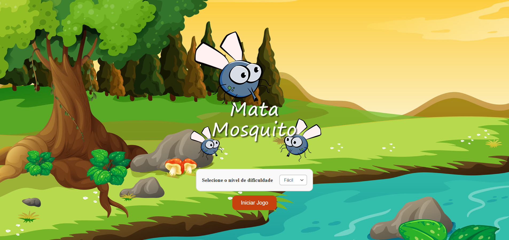

  

## 🎉 Let's go!

Para iniciar o projeto abra o arquivo `index.html` em seu navegador.

## 💻 Projeto

O Jogo Mata Mosquitos é um jogo simples e interativo desenvolvido para web onde o objetivo é clicar rapidamente nos mosquitos que aparecem aleatoriamente na tela antes que desapareçam.

## 🚀 Tecnologias

Esse projeto foi desenvolvido com as seguintes tecnologias:

- HTML e CSS
- JavaScript
